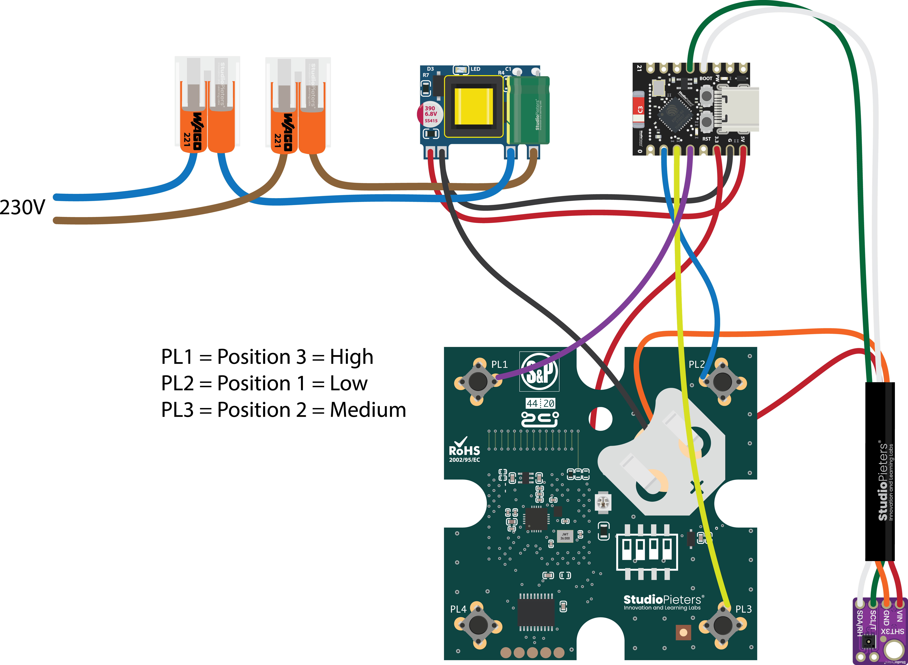

# HomeKit Bathroom Ventilation Controller

**ESP32 • Lifecycle Manager • SHT3X • ISO-style Humidity Control**

This project implements a professional **bathroom ventilation
controller** based on ESP32 using:

-   HomeKit (HAP compliant)
-   Lifecycle Manager (LCM)
-   SHT3X temperature & humidity sensor
-   Automatic humidity-based fan control
-   Manual override with auto fallback
-   HAP-safe notification rate limiting
-   OTA firmware updates
-   Hardware button support
-   Identify LED
-   Fully autonomous offline operation

* * *

# Overview

This is not just a fan switch.

It is a **smart bathroom ventilation controller** designed to:

-   Automatically activate during showering
-   Prevent condensation and mold formation
-   Avoid rapid toggling (hysteresis)
-   Enforce minimum ventilation runtime
-   Return safely to automatic mode after manual override
-   Operate fully offline if HomeKit is unavailable

The control logic runs locally on the ESP32.\\
HomeKit is optional for remote control and monitoring.

* * *

# Ventilation Logic (ISO-style Behavior)

The fan automatically activates when:

-   Humidity rises above a configured threshold (default: 65%)
-   OR a rapid humidity spike is detected (shower detection)
-   OR temperature exceeds configured threshold (optional boost)

The fan stops only when:

-   Humidity drops below threshold minus hysteresis
-   AND minimum runtime has passed

This prevents oscillation and short cycling.

* * *

# Fan Speeds

  Mode   Output Level

* * *

  LOW    30%
  MID    60%
  HIGH   100%

Fan control uses **active-low GPIO pulses** to simulate remote button
presses.

* * *

# Manual Override

The user can control the fan from HomeKit:

-   Turn ON/OFF
-   Set speed

After **20 minutes**, the system automatically returns to AUTO mode.

* * *

# Sensor Processing

To ensure stable readings:

-   EMA smoothing is applied
-   Baseline humidity is learned
-   Relative rise detection identifies shower events
-   Delta-based reporting prevents noise notifications

* * *

# HAP-Safe Notification Strategy

To comply with Apple HAP guidelines:

-   Temperature notify only if change > 0.2°C
-   Humidity notify only if change > 0.5%
-   Minimum notify interval enforced
-   Spike detection allows temporary faster reporting
-   Maximum events per minute limited

This prevents:

-   TCP buffer overflow
-   iOS throttling
-   OTA instability
-   HomeKit disconnects

* * *

# Lifecycle Manager Integration

## Included Headers

```c
#include "esp32-lcm.h"
#include <button.h>
#include "sht3x.h"
```

* * *

## Firmware Version & OTA

```c
homekit_characteristic_t revision =
    HOMEKIT_CHARACTERISTIC_(FIRMWARE_REVISION, LIFECYCLE_DEFAULT_FW_VERSION);

homekit_characteristic_t ota_trigger = API_OTA_TRIGGER;
```

OTA can be triggered from:

-   Home app
-   Hardware button

* * *

# Wi-Fi Handling

Wi-Fi is started using Lifecycle Manager:

```c
wifi_start(on_wifi_ready);
```

The device:

-   Automatically reconnects
-   Supports provisioning
-   Works offline if Wi-Fi is unavailable

* * *

# Hardware Button

Configured using `esp32-button`.

  Action         Result

* * *

  Single press   Request OTA update
  Double press   Reset HomeKit pairing
  Long press     Factory reset (Wi-Fi + HomeKit)

* * *

# Identify LED

Used for HomeKit identify.

  State   LED

* * *

  HIGH    ON
  LOW     OFF

* * *

# Wiring

  Name                       Description       Default

* * *

  CONFIG_ESP_LED_GPIO        Identify LED      2
  CONFIG_ESP_BUTTON_GPIO     Hardware button   32
  CONFIG_ESP_FAN_LOW_GPIO    Fan LOW pulse     configurable
  CONFIG_ESP_FAN_MED_GPIO    Fan MID pulse     configurable
  CONFIG_ESP_FAN_HIGH_GPIO   Fan HIGH pulse    configurable
  CONFIG_I2C_MASTER_SCL      I2C SCL           22
  CONFIG_I2C_MASTER_SDA      I2C SDA           21
  CONFIG_SHT3X_I2C_ADDRESS   Sensor address    0x44

  

* * *

# Requirements

-   ESP-IDF >= 5.0
-   achimpieters/esp32-homekit >= 1.3.3
-   achimpieters/esp32-button >= 1.2.3
-   achimpieters/esp32-sht3x \\^1.0.7
-   wolfssl
-   mdns

* * *

# Expected Behavior

After flashing:

1.  Device boots
2.  Lifecycle initializes
3.  Wi-Fi connects (or provisioning required)
4.  Sensor starts measuring
5.  AUTO mode active
6.  Fan reacts to humidity & temperature

Manual override automatically returns to AUTO after 20 minutes.

* * *

**StudioPieters®**\\
Professional Embedded HomeKit Solutions
